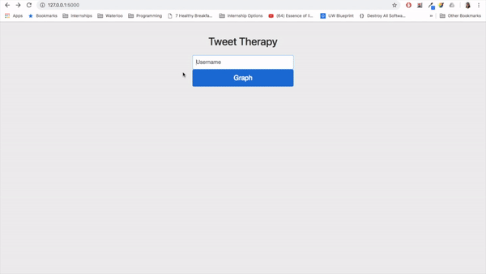

# Tweet Therapy
Analyzing a Twitter user's mood overtime through sentiment analysis of their tweets.

## Demo
\

## Set-Up

```
git clone https://github.com/mirayadav/Tweet-Therapy
cd Tweet-Therapy
pip install -r requirements.txt
```

Before running the app, you must create your own Twitter API keys and store them in a config.py file (formatted like sample_config.py). Then you can run the app by:

```
export FLASK_APP=model.py
flask run
```
Open up ```http://127.0.0.1:5000/``` in browser.

## Reflection
I created Tweet Therapy as a way for me to apply my newly learned knowledge about the various machine learning classifiers in building a practical application. After implementing the Twitter API and fetching a given user's tweets, I started the machine learning pipeline by cleaning the data. I removed any user-name handles, short words, or extra characters from the tweets. Then I was able to conduct sentiment analysis on the tweets using the TextBlob API. Since it is proving to be a bit of a challenge, I am still working on training a Naive Bayes classifier using tweets from Sentiment140 to replace the sentiment analysis using TextBlob. Lastly, I used matplotlib to plot a scatterplot on the sentiment values (using gradient coloring to differentiate moods), and displayed it dynamically on the FLASK web app. Other python libraries used were: num.py and pandas.
